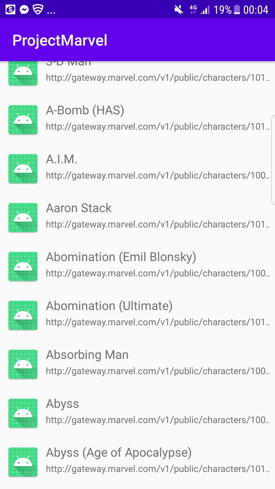
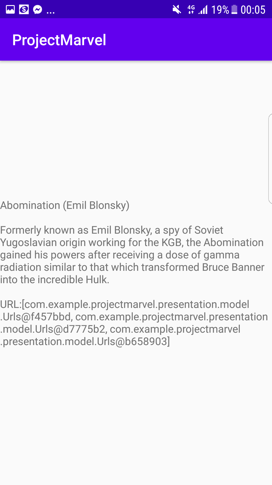

# Application de recensement de personnage Marvel

## Description
Ce projet est une initiation à la programation mobile et à l'utilisation du logiciel Android Studio.
Il permet d'aborder plusieurs éléments clef: MVP , Singletons, Principe SOLID.
Pour cela nous utilserons une Api Marvel qui nous affichera une liste de personnage issue de l'edition Marvel.

## Contenu demandé pour l'application
- API Rest
- Affichage d'une liste dans un RecyclerView
- Stockage de données en cache
- Affichage du détail d'un item de la liste
- Principe SOLID
- Architecture MVP
- Singleton
- Utilisation du GitFlow

## Aperçu de l'application

### Premier écran
On voit ci-dessous l'utilisation et l'affichage de la liste :

### Ecran détail
Ici nous trouvons dans ces images les contenus de deux éléments de la liste:

## Ajout futur

Prochainement nous pourrons trouver dans cette application ces differents aspects:

- Une barre de recherche
- la liste des series, "Comics" et films auquel un personnage est apparu
- Image des personnages dans le RecyclerView et dans le détail des personnages
- Amélioration du design des fiches détails
- Possibilité d'ajouter des Favoris
